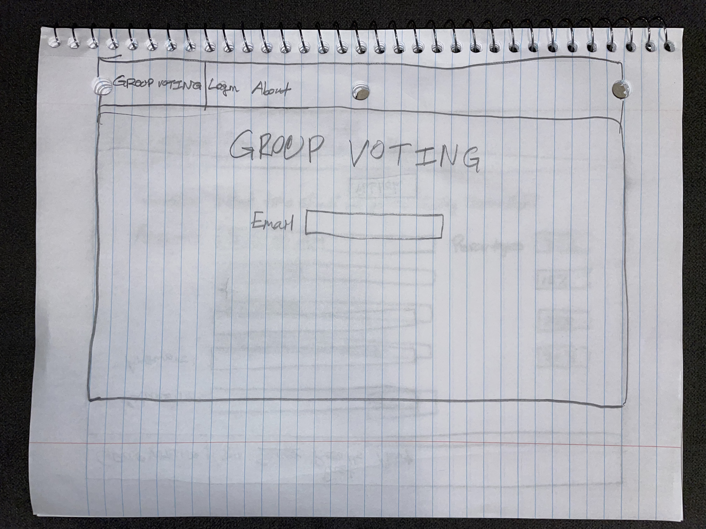
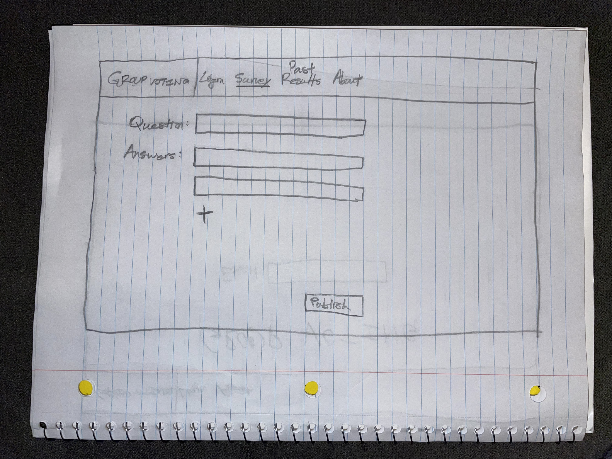

# Group Voting

[My notes.md file](notes.md)

## Elevator Pitch

This is going to be **BIG**!

How much time is wasted when a group can't make a decision quickly?
How can you easily tell what everyone in a group wants to do?
Introducing the solution - a free group voting software that will allow users to:
* Easily create questions and answers
* Collect votes from participants
* See the results in real time

It'll be quick, efficient, and let you know exactly what you need to!

## Design

This first image shows what the login page will look like. Clear and to the point.

Next, the user will will be allowed to create a survey, as shown in the image below. Additional answers can be added using the + button.

Finally, each user will be able to participate and see the results as they come in. *In real time!*

## Key Features

 - Logging in with an email
 - Creating a survey question with answers
 - Publishing the survey for participants
 - Respondents can submit an answer, and later change it if they so wish
 - Results are shown live as answers are submitted
 - Past surveys and their results are saved for future reference

## Technologies

The following technologies will be used on this website:

 * **HTML** - This will be used for the design and organization of the website. There will be a page for logging in, surveying, seeing past results, and reading about the website.
 * **CSS** - I'll use this to add a color scheme, making sure that the website is visually pleasing.
 * **JavaScript** - This will be used as the user creates a survey for publication and as participants submit a response.
 * **Web Service** - A service will be used for logging in and retrieving votes.
 * **Login** - A survey can't be created or response submitted unless the user is logged in.
 * **WebSocket** - This will be used to display the results live as they come in.
 * **React** - The website will be made into a modern framework with this.
