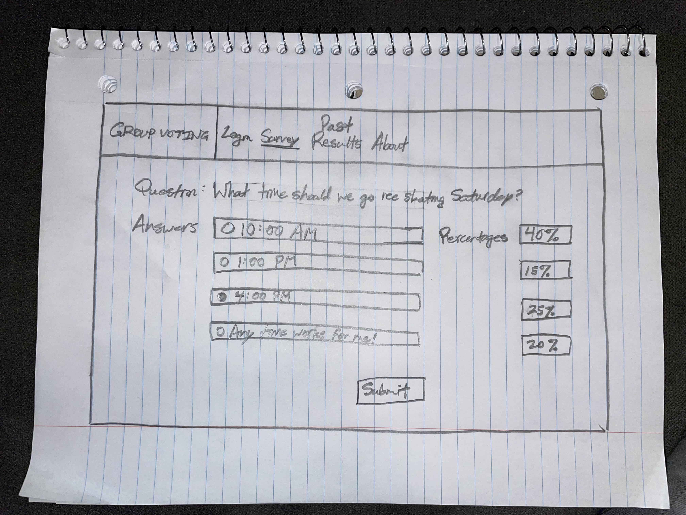

# Group Voting

[My notes.md file](notes.md)

## Elevator Pitch

This is going to be **BIG**!

How much time is wasted when a group can't make a decision quickly?
How can you easily tell what everyone in a group wants to do?
Introducing the solution - a free group voting software that will allow users to:
* Easily create questions and answers
* Collect votes from participants
* See the results in real time

It'll be quick, efficient, and let you know exactly what you need to!

## Design

This first image shows what the login page will look like. Clear and to the point.

Next, the user will will be allowed to create a survey, as shown in the image below.

Finally, each user will be able to participate and see the results as they come in. *In real time!*

