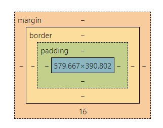

Elastic IP Address: 44.193.31.209

Creating a record for a website on Route 53 allows me to use my domain name (http://groupvoting.click)
to navigate to my website and not just the IP address (http://44.193.31.209).

# Domain names


In the instruction about the internet we showed how an IP address can be referenced by a domain name. You can get the IP address for any domain using the `dig` console utility. Notice that in the following example there are actually multiple IP addresses associated with the domain name `amazon.com`. This allows for redundancy in case one of the IP addresses fails to successfully resolve to a valid connection because the server listening at that IP address is not responding.

```sh
➜  dig amazon.com

amazon.com.		126	IN	A	205.251.242.103
amazon.com.		126	IN	A	52.94.236.248
amazon.com.		126	IN	A	54.239.28.85
```

A domain name is simply a text string that follows a specific naming convention and is listed in a special database called the domain name registry.

Domain names are broken up into a root domain, with one or more possible subdomain prefixes. The root domain is represented by a secondary level domain and a top level domain. The top level domain (TLD) represent things like `com`, `edu`, or `click`. So a root domain would look something like `byu.edu`, `google.com`, or `cs260.click`. The [possible list of TLDs](https://www.icann.org/resources/pages/tlds-2012-02-25-en) is controlled by ICANN, one of the governing boards of the internet.


The owner of a root domain can create any number of subdomains off the root domain. Each subdomain may resolve to a different IP address. So the owner of `cs260.click` can have subdomains for travel (`travel.cs260.click`), finance (`finance.cs260.click`), or a blog (`blog.cs260.click`).

You can get information about a domain name from the domain name registry using the `whois` console utility.

```yaml
➜  whois byu.edu

Domain Name: BYU.EDU

Registrant:
	Brigham Young University
	3009 ITB
	2027 ITB
	Provo, UT 84602
	USA

Administrative Contact:
	Mark Longhurst
	Brigham Young University
	Office of Information Technology
	1208 ITB
	Provo, UT 84602
	USA
	+1.8014220488
	markl@byu.edu

Technical Contact:
	Brent Goodman
	Brigham Young University
	Office of Information Technology
	1203J ITB
	Provo, UT 84602
	USA
	+1.8014227782
	dnsmaster@byu.edu

Domain record activated:    19-Jan-1987
Domain record last updated: 11-Jul-2022
Domain expires:             31-Jul-2025
```

This provides information such as a technical contact to talk to if there is a problem with the domain, and an administrative contact to talk to if you want to buy the domain. Maybe we should talk to Mark and see if he is willing to sell.

## DNS

Once a domain name is in the registry it can be listed with a domain name system (DNS) server and associated with an IP address. Of course you must also lease the IP address before you can use it to uniquely identify a device on the internet, but that is a topic for another time. Every DNS server in the world references a few special DNS servers that are considered the `authoritative name servers` for associating a domain name with an IP address.

The DNS database records that facilitate the mapping of domain names to IP addresses come in several flavors. The main ones we are concerned with are the `address` (`A`) and the `canonical name` (`CNAME`) records. An `A` record is a straight mapping from a domain name to IP address. A `CNAME` record maps one domain name to another domain name. This acts as a domain name alias. You would use a CNAME to do things like map `byu.com` to the same IP address as `byu.edu` so that either one could be used.

When you enter a domain name into a browser, the browser first checks to see if it has the name already in its cache of names. If it does not, it contacts a DNS server and gets the IP address. The DNS server also keeps a cache of names. If the domain name is not in the cache, it will request the name from an `authoritative name server`. If the authority does not know the name then you get an unknown domain name error. If the process does resolve, then the browser makes the HTTP connection to the associated IP address.

As you can see, there is a lot of levels of name caching. This is done for performance reasons, but it also can be frustrating when you are trying to update the information associated with your domain name. This is where the `time to live` (`TTL`) setting for a domain record comes into play. You can set this to be something short like 5 minutes or as long as several days. The different caching layers should then honor the TTL and clear their cache after the requested period has passed.


# The Console


Before the creation of graphical user interfaces, all computing systems were simple console environments consisting as of a prompt for inputting a command and the display of the command output. All of the original programming tools ran as console application. The console tradition is still actively used by professional developers and most programming tools execute within a console window.

Also known as the command line, shell, or terminal, the console window is an essential web development tool. The console provides access to the file system and allows for the execution of command line applications.


### Testing your console application

Once you have a acceptable console application on your development computer, open it up and make sure you can run a simple POSIX compliant command such as `printf 'hello\n'`.


If this displays `hello` then you are on the right track. If that doesn't work then you are using a console application that is not POSIX compliant. For example, Windows Powershell will not work.

## Viewing the file system

One of the primary purposes of a console application is to view the files on the computer. The files on a computer are organized into a tree structure of nodes called directories. At any given point in time your console is located at one of the directories in the file system. You can see which directory you are in with the `pwd` (present working directory) command.

```sh
➜  pwd

/Users/student/byu//webprogramming260
```

You can list all of the files in the directory with `ls` (list files). Most command line applications take parameters that are specified after you type the application name. For example, `ls` can list all files (even hidden ones) in a long format if you provide the parameter `-la`.

```sh
➜ ls -la

total 16
-rw-r--r--  1 lee  staff   1.0K Nov 19 08:47 LICENSE
-rw-r--r--  1 lee  staff    82B Nov 19 08:47 README.md
drwxr-xr-x  4 lee  staff   128B Nov 19 08:48 profile
drwxr-xr-x  4 lee  staff   128B Nov 19 08:47 react
```

## Executing commands

The other primary purpose of the console is to execute commands. You already did this in the previous section when you executed commands for working with the file system. However, console commands can perform many different operations. Here are some basic commands that you show experiment with.

- **echo** - Output the parameters of the command
- **cd** - Change directory
- **mkdir** - Make directory
- **rmdir** - Remove directory
- **rm** - Remove file(s)
- **mv** - Move file(s)
- **cp** - Copy files
- **ls** - List files
- **curl** - Command line client URL browser
- **grep** - Regular expression search
- **find** - Find files
- **top** - View running processes with CPU and memory usage
- **df** - View disk statistics
- **cat** - Output the contents of a file
- **less** - Interactively output the contents of a file
- **wc** - Count the words in a file
- **ps** - View the currently running processes
- **kill** - Kill a currently running process
- **sudo** - Execute a command as a super user (admin)
- **ssh** - Create a secure shell on a remote computer
- **scp** - Securely copy files to a remote computer
- **history** - Show the history of commands
- **ping** - Check if a website is up
- **tracert** - Trace the connections to a website
- **dig** - Show the DNS information for a domain
- **man** - Look up a command in the manual

You can also chain the input and output of commands using special characters

- `|` - Take the output from the command on the left and _pipe_, or pass, it to the command on the right
- `>` - Redirect output to a file. Overwrites the file if it exists
- `>>` - Redirect output to a file. Appends if the file exists

For example, you can list the files in a directory, pipe it into `grep` to search for files created in Nov, and then pipe that into `wc` to count the number of files found with a date of Nov.

```
ls -l | grep ' Nov ' | wc -l
```

There are also keystrokes that have special meaning in the console.

- `CTRL-R` - Use type ahead to find previous commands
- `CTRL-C` - Kill the currently running command


## **HTML Syntax**

Comment: <!-- The comment -->

<!-- <!DOCTYPE html> -->

<!-- <html lang = 'en' -->

    

    <a href= "URL"> The hyperlinked text </a>

    <h1></h1>

    <ul> Unordered list
        <li>List element</li>
    </ul>

    <ol>
        <li>Ordered list element</li>
    </ol>

    <table>
        <tr>
            <th>Table header</th>
            <th>Another column header</th>
        </tr>
        <tr>
            <td>Normal text </td>
        </tr>
    </table>
    <aside>
    <span>
    <div>
    <section>

```html
<input type="____" > </input
```
Has a range of options. type =
| Type           | Meaning                           |
| -------------- | --------------------------------- |
| text           | Single line textual value         |
| password       | Obscured password                 |
| email          | Email address                     |
| tel            | Telephone number                  |
| url            | URL address                       |
| number         | Numerical value                   |
| checkbox       | Inclusive selection               |
| radio          | Exclusive selection               |
| range          | Range limited number              |
| date           | Year, month, day                  |
| datetime-local | Date and time                     |
| month          | Year, month                       |
| week           | Week of year                      |
| color          | Color                             |
| file           | Local file                        |
| submit         | button to trigger form submission |

### Media Elements
</audio --> autoplay and loop

<video controls width="300" crossorigin="anonymous">
  <source src="https://commondatastorage.googleapis.com/gtv-videos-bucket/sample/BigBuckBunny.mp4" />
</video

<svg viewBox="0 0 300 200" xmlns="http://www.w3.org/2000/svg" stroke="red" fill="red" style="border: 1px solid #000000">
  <circle cx="150" cy="100" r="50" />
</svg >

# CSS


# JavaScript

```
console.log('hello');

// OUTPUT: hello

console.log('%c JavaScript Demo', 'font-size:1.5em; color:green;');

// OUTPUT: JavaScript Demo //in large green text

console.time('demo time');

// ... some code that takes a long time.

console.timeEnd('demo time');

// OUTPUT: demo time: 9762.74 ms

console.count('a');
// OUTPUT: a: 1

console.count('a');
// OUTPUT: a: 2

console.count('b');
// OUTPUT: b: 1
```

## Adding JavaScript to HTML

You can insert JavaScript into HTML either by directly including it in the HTML within the content of a `<script>` element, or by using the `src` attribute of the script element to reference an external JavaScript file.

**index.js**

```js
function sayHello() {
  console.log('hello');
}
```

**index.html**

```html
<head>
  <script src="javascript.js"></script>
</head>
<body>
  <button onclick="sayHello()">Say Hello</button>
  <button onclick="sayGoodbye()">Say Goodbye</button>
  <script>
    function sayGoodbye() {
      alert('Goodbye');
    }
  </script>
</body>
```

## Array

📖 **Deeper dive reading**: [MDN Array](https://developer.mozilla.org/en-US/docs/Web/JavaScript/Reference/Global_Objects/Array)

JavaScript array objects represent a sequence of other objects and primitives. You can reference the members of the array using a zero based index. You can create an array with the Array constructor or using the array literal notation shown below.

```js
const a = [1, 2, 3];
console.log(a[1]);
// OUTPUT: 2

console.log(a.length);
// OUTPUT: 3
```

## Object functions

The Array object has several interesting static functions associated with it. Here are some of the interesting ones.

| Function | Meaning                                                   | Example                       |
| -------- | --------------------------------------------------------- | ----------------------------- |
| push     | Add an item to the end of the array                       | `a.push(4)`                   |
| pop      | Remove an item from the end of the array                  | `x = a.pop()`                 |
| slice    | Return a sub-array                                        | `a.slice(1,-1)`               |
| sort     | Run a function to sort an array in place                  | `a.sort((a,b) => b-a)`        |
| values   | Creates an iterator for use with a `for of` loop          | `for (i of a.values()) {...}` |
| find     | Find the first item satisfied by a test function          | `a.find(i => i < 2)`          |
| forEach  | Run a function on each array item                         | `a.forEach(console.log)`      |
| reduce   | Run a function to reduce each array item to a single item | `a.reduce((a, c) => a + c)`   |
| map      | Run a function to map an array to a new array             | `a.map(i => i+i)`             |
| filter   | Run a function to remove items                            | `a.filter(i => i%2)`          |
| every    | Run a function to test if all items match                 | `a.every(i => i < 3)`         |
| some     | Run a function to test if any items match                 | `a.some(i => 1 < 1)`          |

```js
const a = [1, 2, 3];

console.log(a.map((i) => i + i));
// OUTPUT: [2,4,6]
console.log(a.reduce((v1, v2) => v1 + v2));
// OUTPUT: 6
console.log(a.sort((v1, v2) => v2 - v1));
// OUTPUT: [3,2,1]

a.push(4);
console.log(a.length);
// OUTPUT: 4
```

# JavaScript arrow function

Because functions are first order objects in JavaScript they can be declared anywhere and passed as parameters. This results in code with lots of anonymous functions cluttering things up. To make the code more compact the `arrow` syntax was created. This syntax replaces the need for the `function` keyword with the symbols `=>` placed after the parameter declaration. The enclosing curly braces are also optional.

This is a function in arrow syntax that takes no parameters and always returns 3.

```js
() => 3;
```

The following two invocations of sort are equivalent.

```js
const a = [1, 2, 3, 4];

// standard function syntax
a.sort(function (v1, v2) {
  return v1 - v2;
});

// arrow function syntax
a.sort((v1, v2) => v1 - v2);
```

Besides being compact, the `arrow` function syntax has some important semantic differences from the standard function syntax. This includes restrictions that arrow functions cannot be used for constructors or iterator generators.

## Return values

Arrow functions also have special rules for the `return` keyword. The return keyword is optional if no curly braces are provided for the function and it contains a single expression. In that case the result of the expression is automatically returned. If curly braces are provided then the arrow function behaves just like a standard function.

```js
() => 3;
// RETURNS: 3

() => {
  3;
};
// RETURNS: undefined

() => {
  return 3;
};
// RETURNS: 3
```

## This pointer

Next, arrow functions inherit the `this` pointer from the scope of where it is created. This makes what is known as a `closure`. A closure allows a function to continue referencing its creation scope, even after it has passed out of that scope. This can be tricky to wrap your head around, and we discuss it in detail when we later talk about JavaScript `scope`. For now consider the following example.

The function `makeClosure` returns an anonymous function using the arrow syntax. Notice that the `a` parameter is overridden, a new `b` variable is created, and both `a` and `b` are referenced in the arrow function. Because of that reference, they are both part of the closure for the returned function.

```js
function makeClosure(a) {
  a = 'a2';
  const b = 'b2';
  return () => [a, b];
}
```

Next, we declare the variables `a` and `b` at the top level scope, and call `makeClosure` with `a`.

```js
const a = 'a';
const b = 'b';

const closure = makeClosure(a);
```

Now, when we call `closure` function it will output the values contained in scope where it was created instead of the current values of the variables.

```js
console.log(closure());
// OUTPUT: ['a2', 'b2']

console.log(a, b);
// OUTPUT: 'a' 'b'
```

Closures provide a valuable property when we do things like execute JavaScript within the scope of an HTML page, because it can remember the values of variables when the function was created instead of what they are when they are executed.

## Putting it all together

Now that you know how functions work in JavaScript, let's look at an example that demonstrates the use of functions, arrow functions, parameters, a function as a parameter (callback), closures, and browser event listeners. This is done by implementing a `debounce` function.

The point of a debounce function is to only execute a specified function once within a given time window. Any requests to execute the debounce function more frequently than this will case the time window to reset. This is important in cases where a user can trigger expensive events thousands of times per second. Without a debounce the performance of your application can greatly suffer.

The following code calls the browser's `window.addEventListener` function to add a callback function that is invoked whenever the user scrolls the browser's web page. The first parameter to `addEventListener` specifies that it wants to listen for `scroll` events. The second parameter provides the function to call when a scroll event happens. In this case we call a function named `debounce`.

The debounce function takes two parameters, the time window for executing the window function, and the window function to call within that limit. In this case we will execute the arrow function at most every 500 milliseconds.

```js
window.addEventListener(
  'scroll',
  debounce(500, () => {
    console.log('Executed an expensive calculation');
  })
);
```

The debounce function implements the execution of windowFunc within the restricted time window by creating a closure that contains the current timeout and returning a function that will reset the timeout every time it is called. The returned function is what the scroll event will actually call when the user scrolls the page. However, instead of directly executing the `windowFunc` it sets a timer based on the value of `windowMs`. If the debounce function is called again before the window times out then it resets the timeout.

```js
function debounce(windowMs, windowFunc) {
  let timeout;
  return function () {
    console.log('scroll event');
    clearTimeout(timeout);
    timeout = setTimeout(() => windowFunc(), windowMs);
  };
}
```

# JavaScript Async/await

📖 **Deeper dive reading**: [MDN async function](https://developer.mozilla.org/en-US/docs/Web/JavaScript/Reference/Statements/async_function)

JavaScript Promise objects are great for asynchronous execution, but as developers began to build large systems with promises they started wanting a more concise representation. This was provided with the introduction of the `async/await` syntax. The `await` keyword wraps the execution of a promise and removed the need to chain functions. The `await` expression will block until the promise state moves to `fulfilled`, or throws an exception if the state moves to `rejected`. For example, if we have a function that returns a coin toss promise.

```js
const coinToss = () => {
  return new Promise((resolve, reject) => {
    setTimeout(() => {
      if (Math.random() > 0.1) {
        resolve(Math.random() > 0.5 ? 'heads' : 'tails');
      } else {
        reject('fell off table');
      }
    }, 1000);
  });
};
```

We can create equivalent executions with either a promise `then/catch` chain, or an `await` with a `try/catch` block.

**then/catch chain version**

```js
coinToss()
  .then((result) => console.log(`Toss result ${result}`))
  .catch((err) => console.error(`Error: ${err}`))
  .finally(() => console.log(`Toss completed`));
```

**async, try/catch version**

```js
try {
  const result = await coinToss();
  console.log(`Toss result ${result}`);
} catch (err) {
  console.error(`Error: ${err}`);
} finally {
  console.log(`Toss completed`);
}
```

## async

One important restriction for working with `await` is that you cannot call await unless it is called at the top level of the JavaScript, or is in a function that is defined with the `async` keyword. Applying the `async` keyword transforms the function so that it returns a promise that will resolve to the value that was previously returned by the function. Basically this turns any function into an asynchronous function, so that it can in turn make asynchronous requests.

This can be demonstrated with a function that makes animal noises. Notice that the return value is a simple string.

```js
function cow() {
  return 'moo';
}
console.log(cow());
// OUTPUT: moo
```

If we designate the function to be asynchronous then the return value becomes a promise that is immediately resolved and has a value that is the return value of the function.

```js
async function cow() {
  return 'moo';
}
console.log(cow());
// OUTPUT: Promise {<fulfilled>: 'moo'}
```

We then change the cow function to explicitly create a promise instead of the automatically generated promise that the await keyword generates.

```js
async function cow() {
  return new Promise((resolve) => {
    resolve('moo');
  });
}
console.log(cow());
// OUTPUT: Promise {<pending>}
```

You can see that the promise is in the pending state because the promise's execution function has not yet resolved.

## await

The `async` keyword declares that a function returns a promise. The `await` keyword wraps a call to the `async` function, blocks execution until the promise has resolved, and then returns the result of the promise.

We can demonstrate `await` in action with the cow promise from above. If we log the output from invoking `cow` then we see that the return value is a promise. However, if we prefix the call to the function with the await keyword, execution will stop until the promise has resolved, at which point the result of the promise is returned instead of the actual promise object.

```js
console.log(cow());
// OUTPUT: Promise {<pending>}

console.log(await cow());
// OUTPUT: moo
```

By combining `async`, to define functions that return promises, with `await`, to wait on the promise, you can create code that is asynchronous, but still maintains the flow of the code without explicitly using callbacks.

## Putting it all together

You can see the benefit for `async`/`await` clearly by considering a case where multiple promises are required. For example, when calling the `fetch` web API on an endpoint that returns JSON, you would need to resolve two promises. One for the network call, and one for converting the result to JSON. A promise implementation would look like the following.

```js
const httpPromise = fetch('https://simon.cs260.click/api/user/me');
const jsonPromise = httpPromise.then((r) => r.json());
jsonPromise.then((j) => console.log(j));
console.log('done');

// OUTPUT: done
// OUTPUT: {email: 'bud@mail.com', authenticated: true}
```

With async/await, you can clarify the code intent by hiding the promise syntax, and also make the execution block until the promise is resolved.

```js
const httpResponse = await fetch('https://simon.cs260.click/api/user/me');
const jsonResponse = await httpResponse.json();
console.log(jsonResponse);
console.log('done');

// OUTPUT: {email: 'bud@mail.com', authenticated: true}
// OUTPUT: done
```

# JavaScript destructuring

📖 **Deeper dive reading**: [MDN Destructuring](https://developer.mozilla.org/en-US/docs/Web/JavaScript/Reference/Operators/Destructuring_assignment)

Destructuring, not to be confused with destructing, is the process of pulling individual items out of an existing one, or removing structure. You can do this with either arrays or objects. This is helpful when you only care about a few items in the original structure.

An example of destructuring arrays looks like the following.

```js
const a = [1, 2, 4, 5];

// destructure the first two items from a, into the new variables b and c
const [b, c] = a;

console.log(b, c);
// OUTPUT: 1, 2
```

Note that even though it looks like you are declaring an array with the syntax on the left side of the expression, it is only specifying that you want to destructure those values out of the array.

You can also combine multiple items from the original object using rest syntax.

```js
const [b, c, ...others] = a;

console.log(b, c, others);
// OUTPUT: 1, 2, [4,5]
```

This works in a similar manner for objects, except with arrays, the assignment of the associated value was assumed by the positions in the two arrays. When destructuring objects, you explicitly specify the properties you want to pull from the source object.

```js
const o = { a: 1, b: 'animals', c: ['fish', 'cats'] };

const { a, c } = o;

console.log(a, c);
// OUTPUT 1, ['fish', 'cats']
```

You can also map the names to new variables instead of just using the original property names.

```js
const o = { a: 1, b: 'animals', c: ['fish', 'cats'] };

const { a: count, b: type } = o;

console.log(count, type);
// OUTPUT 1, animals
```

Default values may also be provided for missing ones.

```js
const { a, b = 22 } = {};
const [c = 44] = [];

console.log(a, b, c);
// OUTPUT: undefined, 22, 44
```

Note that all of the above examples created new constant variables, but you can also use destructuring to reassign existing variables.

```js
let a = 22;

[a] = [1, 2, 3];

console.log(a);
// OUTPUT: 1
```

# Document Object Model

📖 **Deeper dive reading**:

- [MDN Introduction to the DOM](https://developer.mozilla.org/en-US/docs/Web/API/Document_Object_Model/Introduction)
- [W3C DOM specification](https://www.w3.org/TR/REC-DOM-Level-1/level-one-core.html) - This official specification is only for reference

The Document Object Model (DOM) is an object representation of the HTML elements that the browser uses to render the display. The browser also exposes the DOM to external code so that you can write programs that dynamically manipulate the HTML.

The browser provides access to the DOM through a global variable name `document` that points to the root element of the DOM. If you open the browser's debugger console window and type the variable name `document` you will see the DOM for the document the browser is currently rendering.

```html
> document

<html lang="en">
  <body>
    <p>text1 <span>text2</span></p>
    <p>text3</p>
  </body>
</html>
```

```css
p {
  color: red;
}
```

For everything in an HTML document there is a node in the DOM. This includes elements, attributes, text, comments, and whitespace. All of these nodes form a big tree, with the document node at the top.


## Accessing the DOM

Every element in an HTML document implements the DOM Element interface, which is derived from the DOM Node interface. The [DOM Element Interface](https://developer.mozilla.org/en-US/docs/Web/API/Element) provides the means for iterating child elements, accessing the parent element, and manipulating the element's attributes. From your JavaScript code, you can start with the `document` variable and walk through the every element in the tree.

```js
function displayElement(el) {
  console.log(el.tagName);
  for (const child of el.children) {
    displayElement(child);
  }
}

displayElement(document);
```

You can provide a CSS selector to the `querySelectorAll` function in order to select elements from the document. The `textContent` property contains all of the element's text. You can even access a textual representation of an element's HTML content with the `innerHTML` property.

```js
const listElements = document.querySelectorAll('p');
for (const el of listElements) {
  console.log(el.textContent);
}
```

## Modifying the DOM

The DOM supports the ability to insert, modify, or delete the elements in the DOM. To create a new element you first create the element on the DOM document. You then insert the new element into the DOM tree by appending it to an existing element in the tree.

```js
function insertChild(parentSelector, text) {
  const newChild = document.createElement('div');
  newChild.textContent = text;

  const parentElement = document.querySelector(parentSelector);
  parentElement.appendChild(newChild);
}

insertChild('#courses', 'new course');
```

To delete elements call the `removeChild` function on the parent element.

```js
function deleteElement(elementSelector) {
  const el = document.querySelector(elementSelector);
  el.parentElement.removeChild(el);
}

deleteElement('#courses div');
```

## Injecting HTML

The DOM also allows you to inject entire blocks of HTML into an element. The following code finds the first `div` element in the DOM and replaces all the HTML it contains.

```js
const el = document.querySelector('div');
el.innerHTML = '<div class="injected"><b>Hello</b>!</div>';
```

However, directly injecting HTML as a block of text is a common attack vector for hackers. If an untrusted party can inject JavaScript anywhere in your application then that JavaScript can represent itself as the current user of the application. The attacker can then make requests for sensitive data, monitor activity, and steal credentials. The example below shows how the img element can be used to launch an attack as soon as the page is loaded.

```html

```

If you are injecting HTML, make sure that it cannot be manipulated by a user. Common injection paths include HTML input controls, URL parameters, and HTTP headers. Either sanitize any HTML that contains variables, or simply use DOM manipulation functions instead of using `innerHTML`.

## Event Listeners

All DOM elements support the ability to attach a function that gets called when an event occurs on the element. These functions are called [event listeners](https://developer.mozilla.org/en-US/docs/Web/API/EventTarget/addEventListener). Here is an example of an event listener that gets called when an element gets clicked.

```js
const submitDataEl = document.querySelector('#submitData');
submitDataEl.addEventListener('click', function (event) {
  console.log(event.type);
});
```

There are lots of possible events that you can add a listener to. This includes things like mouse, keyboard, scrolling, animation, video, audio, WebSocket, and clipboard events. You can see the full list on [MDN](https://developer.mozilla.org/en-US/docs/Web/Events). Here are a few of the more commonly used events.

| Event Category | Description           |
| -------------- | --------------------- |
| Clipboard      | Cut, copied, pasted   |
| Focus          | An element gets focus |
| Keyboard       | Keys are pressed      |
| Mouse          | Click events          |
| Text selection | When text is selected |

You can also add event listeners directly in the HTML. For example, here is a `onclick` handler that is attached to a button.

```html
<button onclick='alert("clicked")'>click me</button>
```

# JavaScript exceptions

📖 **Deeper dive reading**: [MDN try...catch](https://developer.mozilla.org/en-US/docs/Web/JavaScript/Reference/Statements/try...catch)

JavaScript supports exception handling using the `try catch` and `throw` syntax. An exception can be triggered whenever your code generates an exception using the `throw` keyword, or whenever an exception is generated by the JavaScript runtime, for example, when an undefined variable is used.

To catch a thrown exception, you wrap a code block with the `try` keyword, and follow the try block with a `catch` block. If within the try block, including any functions that block calls, an exception is thrown, then all of the code after the throw is ignored, the call stack is unwound, and the catch block is called.

In addition to a catch block, you can specify a `finally` block that is always called whenever the `try` block is exited regardless if an exception was ever thrown.

The basic syntax looks like the following.

```js
try {
  // normal execution code
} catch (err) {
  // exception handling code
} finally {
  // always called code
}
```

For example:

```js
function connectDatabase() {
  throw new Error('connection error');
}

try {
  connectDatabase();
  console.log('never executed');
} catch (err) {
  console.log(err);
} finally {
  console.log('always executed');
}

// OUTPUT: Error: connection error
//         always executed
```

⚠ When first using exception handling it is tempting to use it as way to handle normal flows of execution. For example, throwing a `file not found` exception when it is common for users to request nonexistent files. Throwing exceptions should only happen when something truly exceptional occurs. For example, a `file not found` exception when the file is required for your code to run, such as a required configuration file. Your code will be easier to debug, and your logs more meaningful if you restrict exceptions to truly exceptional situations.

## Fallbacks

The fallback pattern is commonly implemented using exception handling. To implement the fallback pattern you put the normal feature path in a try block and then provide a fallback implementation in the catch block. For example, normally you would get the high scores for a game by making a network request, but if the network is not available then a locally cached version of the last available scores is used. By providing a fallback, you can always return something, even if the desired feature is temporarily unavailable.

```js
function getScores() {
  try {
    const scores = scoringService.getScores();
    // store the scores so that we can use them later if the network is not available
    window.localStorage.setItem('scores', scores);
    return scores;
  } catch {
    return window.localStorage.getItem('scores');
  }
}
```

# Functions

📖 **Deeper dive reading**: [MDN Functions](https://developer.mozilla.org/en-US/docs/Web/JavaScript/Reference/Functions)

In JavaScript functions are first class objects. That means that they can be assigned a name, passed as a parameter, returned as a result, and referenced from an object or array just like any other variable.

The basic syntax of a function begins with the `function` keyword followed by zero or more parameters and a body that may contain zero or more return statements. The return statement may return a single value. Note that there are no type declarations, as the type is always inferred by the assignment of the value to the parameter.

```js
function hello(who) {
  return 'hello ' + who;
}

console.log(hello('world'));
// OUTPUT: hello world
```

A function without a return value usually exists to produce some side effect like modifying a parameter or interacting with an external program. In the following example the side effect of the function is to output text to the debugger console.

```js
function hello(who) {
  who.count++;
  console.log('hello ' + who.name);
}

hello({ name: 'world', count: 0 });
// OUTPUT: hello world
```

## Function parameters

When a function is called, the caller may choose what parameters to provide. If a parameter is not provided then the value of the parameter is `undefined` when the function executes.

In addition to explicitly passing the value of a parameter to a function, the function can define a default value. This is done by assigning a value to the parameter in the function declaration.

```js
function labeler(value, title = 'title') {
  console.log(`${title}=${value}`);
}

labeler();
// OUTPUT: title=undefined

labeler('fish');
// OUTPUT: title=fish

labeler('fish', 'animal');
// OUTPUT: animal=fish
```

## Anonymous functions

Functions in JavaScript are commonly assigned to a variable so that they can be passed as a parameter to some other function or stored as an object property. To easily support this common use you can define a function anonymously and assign it to a variable.

```js
// Function that takes a function as a parameter
function doMath(operation, a, b) {
  return operation(a, b);
}

// Anonymous function assigned to a variable
const add = function (a, b) {
  return a + b;
};

console.log(doMath(add, 5, 3));
// OUTPUT: 8

// Anonymous function assigned to a parameter
console.log(
  doMath(
    function (a, b) {
      return a - b;
    },
    5,
    3
  )
);
// OUTPUT: 2
```

## Creating, passing, and returning functions

Here are examples of assigning functions to variables, as well as using functions as parameters and return values.

```js
// Anonymous declaration of the function that is later assigned to a variable
const add = function (a, b) {
  return a + b;
};

// Function that logs as a side effect of its execution
function labeler(label, value) {
  console.log(label + '=' + value);
}

// Function that takes a function as a parameter and then executes the function as a side effect
function addAndLabel(labeler, label, adder, a, b) {
  labeler(label, adder(a, b));
}

// Passing a function to a function
addAndLabel(labeler, 'a+b', add, 1, 3);
// OUTPUT: a+b=4

// Function that returns a function
function labelMaker(label) {
  return function (value) {
    console.log(label + '=' + value);
  };
}

// Assign a function from the return value of the function
const nameLabeler = labelMaker('name');

// Calling the returned function
nameLabeler('value');
// OUTPUT: name=value
```

## Inner functions

Functions can also be declared inside other functions. This allows you to modularize your code without always exposing private details.

```js
function labeler(value) {
  function stringLabeler(value) {
    console.log('string=' + value);
  }
  function numberLabeler(value) {
    console.log('number=' + value);
  }

  if (typeof value == 'string') {
    stringLabeler(value);
  } else if (typeof value == 'number') {
    numberLabeler(value);
  }
}

labeler(5);
// OUTPUT: number=5

labeler('fish');
// OUTPUT: string=fish
```

## JSON

📖 **Deeper dive reading**:

- [MDN JSON](https://developer.mozilla.org/en-US/docs/Web/JavaScript/Reference/Global_Objects/JSON)
- [Douglas Crockford: The JSON Saga](https://www.youtube.com/watch?v=-C-JoyNuQJs)

JavaScript Object Notation (JSON) was conceived by Douglas Crockford in 2001 while working at Yahoo! JSON, pronounced like the name Jason, received official standardization in 2013 and 2017 (ECMA-404, [RFC 8259](https://datatracker.ietf.org/doc/html/rfc8259)).

JSON provides a simple, and yet effective way, to share and store data. By design JSON is easily convertible to, and from, JavaScript objects. This make it a very convenient data format when working with web technologies. Because of its simplicity, standardization, and compatibility with JavaScript, JSON has become one of the world's most popular data formats.

### Format

A JSON document contains one of the following data types:

| Type    | Example                 |
| ------- | ----------------------- |
| string  | "crockford"             |
| number  | 42                      |
| boolean | true                    |
| array   | [null,42,"crockford"]   |
| object  | {"a":1,"b":"crockford"} |
| null    | null                    |

Most commonly, a JSON document contains an object. Objects contain zero or more key value pairs. The key is always a string, and the value must be one of the valid JSON data types. Key value pairs are delimited with commas. Curly braces delimit an object, square brackets and commas delimit arrays, and strings are always delimited with double quotes.

Here is an example of a JSON document.

```json
{
  "class": {
    "title": "web programming",
    "description": "Amazing"
  },
  "enrollment": ["Marco", "Jana", "فَاطِمَة"],
  "start": "2025-02-01",
  "end": null
}
```

JSON is always encoded with [UTF-8](https://en.wikipedia.org/wiki/UTF-8). This allows for the representation of global data.

### Converting to JavaScript

You can convert JSON to, and from, JavaScript using the `JSON.parse` and `JSON.stringify` functions.

```js
const obj = { a: 2, b: 'crockford', c: undefined };
const json = JSON.stringify(obj);
const objFromJson = JSON.parse(json);

console.log(obj, json, objFromJson);

// OUTPUT:
// {a: 2, b: 'crockford', c: undefined}
// {"a":2, "b":"crockford"}
// {a: 2, b: 'crockford'}
```

Note that in this example, JSON cannot represent the JavaScript `undefined` object and so it gets dropped when converting from JavaScript to JSON.

# JavaScript modules

📖 **Deeper dive reading**: [MDN JavaScript modules](https://developer.mozilla.org/en-US/docs/Web/JavaScript/Guide/Modules)

JavaScript modules allow for the partitioning and sharing of code. Initially JavaScript had no support for modules. Node.js, a server side JavaScript execution application, introduced the concept of modules in order to support the importing of packages of JavaScript from third party providers.

JavaScript got full module support with ES6, and they have become the standard module representation as [browser support](https://caniuse.com/es6-module-dynamic-import) for ES modules is now almost universal.

In order to differentiate between the two implementations, Node.js modules are called CommonJS modules, and JavaScript modules are called ES modules. For this discussion, we will focus only on ES modules.

Because modules create a file-based scope for the code they represent, you must explicitly `export` the objects from one file and then `import` them into another file. For example, here is a simple module that exports a function that displays an alert.

**alert.js**

```js
export function alertDisplay(msg) {
  alert(msg);
}
```

You can import the module's exported function into another module using the `import` keyword.

**main.js**

```js
import { alertDisplay } from './alert.js';

alertDisplay('called from main.js');
```

## ES Modules in the browser

When you use ES modules in the browser via HTML script references, things get a little complicated. The key thing to understand is that modules can only be called from other modules. You cannot access JavaScript contained in a module from the global scope that your non-module JavaScript is executing in.

From your HTML, you can specify that you are using an ES module by including a `type` attribute with the value of `module` in the `script` element. You can then import and use other modules. This is shown in the example below.

**index.html**

```html
<script type="module">
  import { alertDisplay } from './alert.js';
  alertDisplay('module loaded');
</script>
```

If we want to use a module in the global scope that our HTML or other non-module JavaScript is executing in, then we must leak it into the global scope. We do this by either attaching an event handler or explicitly adding a function to the global window object. In the example below, we expose the `alertDisplay` imported module function by attaching it to the global JavaScript `window` object so that it can then be called from the button `onclick` handler. We also expose the module function by attaching a `keypress` event.

**index.html**

```html
<html>
  <body>
    <script type="module">
      import { alertDisplay } from './alert.js';
      window.btnClick = alertDisplay;

      document.body.addEventListener('keypress', function (event) {
        alertDisplay('Key pressed');
      });
    </script>
    <button onclick="btnClick('button clicked')">Press me</button>
  </body>
</html>
```

Now, if the button is pushed or a key is pressed our ES module function will be called.

## Modules with web frameworks

Fortunately, when you use a web framework bundler, discussed in later instruction, to generate your web application distribution code, you usually don't have to worry about differentiating between global scope and ES module scope. The bundler will inject all the necessary syntax to connect your HTML to your modules. Historically, this was done by removing the modules and placing all of the JavaScript in a namespaced global partition. Now that ES Modules are supported on most browsers, the bundler will expose the ES module directly.

Because of the complex history of modules they can be a confusing topic, but it is well worth the time to understand how they work as they are a core piece of a web programmer's toolkit.

# JavaScript object and classes

📖 **Deeper dive reading**: [MDN Classes in JavaScript](https://developer.mozilla.org/en-US/docs/Learn/JavaScript/Objects/Classes_in_JavaScript)

A JavaScript object represents a collection of name value pairs referred to as properties. The property name must be of type String or Symbol, but the value can be of any type. Objects also have common object-oriented functionality such as constructors, a `this` pointer, static properties and functions, and inheritance.

Objects can be created with the new operator. This causes the object's constructor to be called. Once declared you can add properties to the object by simply referencing the property name in an assignment. Any type of variable can be assigned to a property. This includes a sub-object, array, or function. The properties of an object can be referenced either with dot (`obj.prop`) or bracket notation (`obj['prop']`).

```js
const obj = new Object({ a: 3 });
obj['b'] = 'fish';
obj.c = [1, 2, 3];
obj.hello = function () {
  console.log('hello');
};

console.log(obj);
// OUTPUT: {a: 3, b: 'fish', c: [1,2,3], hello: func}
```

The ability to dynamically modify an object is incredibly useful when manipulating data with an indeterminate structure.

⚠ Note the different uses of the term `object`. Object can refer to the standard JavaScript objects (e.g. `Promise, Map, Object, Function, Date, ...`), or it can refer specifically to the JavaScript Object object (i.e. `new Object()`), or it can refer to any JavaScript object you create (e.g. `{a:'a', b:2}` ). This overloaded usage can be a bit confusing.

## Object-literals

You can also declare a variable of object type with the `object-literal` syntax. This syntax allows you to provide the initial composition of the object.

```js
const obj = {
  a: 3,
  b: 'fish',
};
```

## Object functions

Object has several interesting static functions associated with it. Here are some of the commonly used ones.

| Function | Meaning                             |
| -------- | ----------------------------------- |
| entries  | Returns an array of key value pairs |
| keys     | Returns an array of keys            |
| values   | Returns an array of values          |

```js
const obj = {
  a: 3,
  b: 'fish',
};

console.log(Object.entries(obj));
// OUTPUT: [['a', 3], ['b', 'fish']]
console.log(Object.keys(obj));
// OUTPUT: ['a', 'b']
console.log(Object.values(obj));
// OUTPUT: [3, 'fish']
```

## Constructor

Any function that returns an object is considered a `constructor` and can be invoked with the `new` operator.

```js
function Person(name) {
  return {
    name: name,
  };
}

const p = new Person('Eich');
console.log(p);
// OUTPUT: {name: 'Eich'}
```

Because objects can have any type of property value you can create methods on the object as part of its encapsulation.

```js
function Person(name) {
  return {
    name: name,
    log: function () {
      console.log('My name is ' + this.name);
    },
  };
}

const p = new Person('Eich');
p.log();
// OUTPUT: My name is Eich
```

## This pointer

Notice in the last example the use of the keyword `this` when we referred to the name property (`this.name`). The meaning of `this` depends upon the scope of where it is used, but in the context of an object it refers to a pointer to the object. We will talk more about the `this` pointer in the instruction on scope.

## Classes

You can use classes to define objects. Using a class clarifies the intent to create a reusable component rather than a one-off object. Class declarations look similar to declaring an object, but classes have an explicit constructor and assumed function declarations. The person object from above would look like the following when converted to a class.

```js
class Person {
  constructor(name) {
    this.name = name;
  }

  log() {
    console.log('My name is ' + this.name);
  }
}

const p = new Person('Eich');
p.log();
// OUTPUT: My name is Eich
```

You can make properties and functions of classes private by prefixing them with a `#`.

```js
class Person {
  #name;

  constructor(name) {
    this.#name = name;
  }
}

const p = new Person('Eich');
p.#name = 'Lie';
// OUTPUT: Uncaught SyntaxError: Private field '#name' must be declared in an enclosing class
```

## Inheritance

Classes can be extended by using the `extends` keyword to define inheritance. Parameters that need to be passed to the parent class are delivered using the `super` function. Any functions defined on the child that have the same name as the parent override the parent's implementation. A parent's function can be explicitly accessed using the `super` keyword.

```js
class Person {
  constructor(name) {
    this.name = name;
  }

  print() {
    return 'My name is ' + this.name;
  }
}

class Employee extends Person {
  constructor(name, position) {
    super(name);
    this.position = position;
  }

  print() {
    return super.print() + '. I am a ' + this.position;
  }
}

const e = new Employee('Eich', 'programmer');
console.log(e.print());
// OUTPUT: My name is Eich. I am a programmer
```

# Promises

📖 **Deeper dive reading**:

- [MDN Using Promises](https://developer.mozilla.org/en-US/docs/Web/JavaScript/Guide/Using_promises)
- [MDN Promise](https://developer.mozilla.org/en-US/docs/Web/JavaScript/Reference/Global_Objects/Promise)

The rendering thread of your HTML executes on a single threaded. That means that you cannot take a long time processing JavaScript on the main rendering thread. Long running, or blocking tasks, should be executed with the use of a JavaScript `Promise`. The execution of a promise allows the main rendering thread to continue while some action is executed in the background.
You create a promise by calling the Promise object constructor and passing it an executor function that runs the asynchronous operation. Executing asynchronously means that promise constructor may return before the promise executor function runs. The state of the promise execution is always in one of three states different states.

1. **pending** - Currently running asynchronously
1. **fulfilled** - Completed successfully
1. **rejected** - Failed to complete

We can demonstrate asynchronous execution by using the standard JavaScript `setTimeout` function to create a delay in the execution of the code. The setTimeout function takes the number of milliseconds to wait and a function to call after that amount of time has expired. We call the delay function in a for loop in the promise executor and also a for loop outside the promise so that both code blocks are running in parallel.

```js
const delay = (msg, wait) => {
  setTimeout(() => {
    console.log(msg, wait);
  }, 1000 * wait);
};

new Promise((resolve, reject) => {
  // Code executing in the promise
  for (let i = 0; i < 3; i++) {
    delay('In promise', i);
  }
});

// Code executing after the promise
for (let i = 0; i < 3; i++) {
  delay('After promise', i);
}

// OUTPUT:
//   In promise 0
//   After promise 0
//   In promise 1
//   After promise 1
//   In promise 2
//   After promise 2
```

## Resolving and rejecting

Now that we know how to use a promise to execute asynchronously, we need to be able to set the state to `fulfilled` when things complete correctly, or to `rejected` when an error happens. The promise executor function takes two functions as parameters, `resolve` and `reject`. Calling `resolve` sets the promise to the `fulfilled` state, and calling `reject` sets the promise to the `rejected` state.

Consider the following "coin toss" promise that waits ten seconds and then has a fifty percent chance of resolving or rejecting.

```js
const coinToss = new Promise((resolve, reject) => {
  setTimeout(() => {
    if (Math.random() > 0.5) {
      resolve('success');
    } else {
      reject('error');
    }
  }, 10000);
});
```

If you log the coinToss promise object to the console immediately after calling the constructor, it will display that it is in the `pending` state.

```js
console.log(coinToss);
// OUTPUT: Promise {<pending>}
```

If you then wait ten seconds and the log the coinToss promise object again, the state will either show as `fulfilled` or `rejected` depending upon the way the coin landed.

```js
console.log(coinToss);
// OUTPUT: Promise {<fulfilled>}
```

## Then, catch, finally

With the ability to asynchronously execute and set the resulting state, we now need a way to generically do something with the result of a promise after it resolves. This is done with functionality similar to exception handling. The promise object has three functions: `then`, `catch`, and `finally`. The `then` function is called if the promise is fulfilled, `catch` is called if the promise is `rejected`, and `finally` is always called after all the processing is completed.

We can rework our coinToss example and make it so 10 percent of the time the coin falls off the table and resolves to the rejected state. Otherwise the promise resolves to fulfilled with a result of either `heads` or `tails`.

```js
const coinToss = new Promise((resolve, reject) => {
  setTimeout(() => {
    if (Math.random() > 0.1) {
      resolve(Math.random() > 0.5 ? 'heads' : 'tails');
    } else {
      reject('fell off table');
    }
  }, 10000);
});
```

We then chain the `then`, `catch` and `finally` functions to the coinToss object in order to handle each of the possible results.

```js
coinToss
  .then((result) => console.log(`Coin toss result: ${result}`))
  .catch((err) => console.log(`Error: ${err}`))
  .finally(() => console.log('Toss completed'));

// OUTPUT:
//    Coin toss result: tails
//    Toss completed
```

# JavaScript regular expressions

📖 **Deeper dive reading**: [MDN Regular expressions](https://developer.mozilla.org/en-US/docs/Web/JavaScript/Guide/Regular_Expressions)

Regular expression support is built right into JavaScript. If you are not familiar with regular expressions, you can think of them as textual pattern matchers. You use a regular expression to find text in a string so that you can replace it, or simply to know that it exists.

You can create a regular expression using the class constructor or a regular expression literal.

```js
const objRegex = new RegExp('ab*', 'i');
const literalRegex = /ab*/i;
```

The `string` class has several functions that accept regular expressions. This includes `match`, `replace`, `search`, and `split`. For a quick test to see if there is a match you can use the regular expression object's `test` function.

```js
const petRegex = /(dog)|(cat)|(bird)/gim;
const text = 'Both cats and dogs are pets, but not rocks.';

text.match(petRegex);
// RETURNS: ['cat', 'dog']

text.replace(petRegex, 'animal');
// RETURNS: Both animals and animals are pets, but not rocks.

petRegex.test(text);
// RETURNS: true
```
Flag	Description
g	Performs a global match, finding all matches rather than just the first.
i	Makes matches case-insensitive. Matches both uppercase and lowercase.
m	Performs multiline matches. (Changes behavior of ^,$)
s	Allows . to match newline characters.
u	Enables Unicode support.
y	Matches are sticky, looking only at exact position in the text.

# JavaScript rest and spread

📖 **Deeper dive reading**:

- [MDN Rest](https://developer.mozilla.org/en-US/docs/Web/JavaScript/Reference/Functions/rest_parameters)
- [MDN Spread](https://developer.mozilla.org/en-US/docs/Web/JavaScript/Reference/Operators/Spread_syntax)

## Rest

Sometimes you want a function to take an unknown number of parameters. For example, if you wanted to write a function that checks to see if some number in a list is equal to a given number, you could write this using an array.

```js
function hasNumber(test, numbers) {
  return numbers.some((i) => i === test);
}

const a = [1, 2, 3];
hasNumber(2, a);
// RETURNS: true
```

However sometimes you don't have an array to work with. In this case you could create one on the fly.

```js
function hasTwo(a, b, c) {
  return hasNumber(2, [a, b, c]);
}
```

But JavaScript provides the `rest` syntax to make this easier. Think of it as a parameter that contains the `rest` of the parameters. To turn the last parameter of any function into a `rest` parameter you prefix it with three periods. You can then call it with any number of parameters and they are all automatically combined into an array.

```js
function hasNumber(test, ...numbers) {
  return numbers.some((i) => i === test);
}

hasNumber(2, 1, 2, 3);
// RETURNS: true
```

Note that you can only make the last parameter a `rest` parameter. Otherwise JavaScript would not know which parameters to combine into the array.

Technically speaking, `rest` allows JavaScript to provide what is called variadic functions.

## Spread

Spread does the opposite of rest. It take an object that is iterable (e.g. array or string) and expands it into a function's parameters. Consider the following.

```js
function person(firstName, lastName) {
  return { first: firstName, last: lastName };
}

const p = person(...['Ryan', 'Dahl']);
console.log(p);
// OUTPUT: {first: 'Ryan', last: 'Dahl'}
```

# Scope

📖 **Deeper dive reading**:

- [MDN Scope](https://developer.mozilla.org/en-US/docs/Glossary/Scope)
- [MDN this](https://developer.mozilla.org/en-US/docs/Web/JavaScript/Reference/Operators/this)
- [MDN Closures](https://developer.mozilla.org/en-US/docs/Web/JavaScript/Closures)

Understanding JavaScript scope is essential for making your programs run as you expect. Scope is defined as the variables that are visible in the current context of execution. JavaScript has four different types of scope:

1. **Global** - Visible to all code
1. **Module** - Visible to all code running in a module
1. **Function** - Visible within a function
1. **Block** - Visible within a block of code delimited by curly braces

## Var

Initially JavaScript used the keyword `var` to declare a variable. The problem with var, unlike `const` or `let`, is that it ignores block scope. Variables declared with `var` are always logically hoisted to the top of the function. For example, the following code shows the same variable name being used within different enclosing scopes. However, because var ignores block scope the for loop is simply assigning a new value to `x` rather than declaring a new variable that has the same name.

```js
var x = 10;
console.log('start', x);

for (var x = 0; x < 1; x++) {
  console.log('middle', x);
}

console.log('end', x);

// OUTPUT: start 10
//         middle 0
//         end 1
```

⚠ There are few cases where it makes sense to use `var`. It is strongly suggested that you only use `const` and `let` unless you fully understand why you are using `var`.

## This

The keyword `this` represents a variable that points to an object that contains the context within the scope of the currently executing line of code. The `this` variable is automatically declared and you can reference `this` anywhere in a JavaScript program. Because the value of `this` depends upon the context in which it is referenced, there are three different context that this can refer to:

1. **Global** - When `this` is referenced outside a function or object it refers to the `globalThis` object. The globalThis object represents the context for runtime environment. For example, when running in a browser, globalThis refers to the browser's window object.
1. **Function** - When `this` is referenced in a function it refers to the object that owns the function. That is either an object you defined or globalThis if the function is defined outside of an object. Note that when running in JavaScript strict mode, a global function's this variable is undefined instead of globalThis.
1. **Object** - When `this` is referenced in an object it refers to the object.

```js
'use strict';

// global scope
console.log('global:', this);
console.log('globalThis:', globalThis);

// function scope for a global function
function globalFunc() {
  console.log('globalFunctionThis:', this);
}
globalFunc();

// object scope
class ScopeTest {
  constructor() {
    console.log('objectThis:', this);
  }

  // function scope for an object function
  objectFunc() {
    console.log('objectFunctionThis:', this);
  }
}

new ScopeTest().objectFunc();
```

Running the above code in a browser results in the following.

```
global: Window
globalThis: Window
globalFunctionThis: undefined
objectThis: ScopeTest
objectFunctionThis: ScopeTest
```

Note that if we were not using JavaScript strict mode then globalFunctionThis would refer to Window.

## Closure

A closure is defined as a function and its surrounding state. That means whatever variables are accessible when a function is created are available inside that function. This holds true even if you pass the function outside of the scope of its original creation.

Here is an example of a function that is created as part of an object. That means that function has access to the object's `this` pointer.

```js
globalThis.x = 'global';

const obj = {
  x: 'object',
  f: function () {
    console.log(this.x);
  },
};

obj.f();
// OUTPUT: object
```

Arrow functions are a bit different because they inherit the `this` pointer of their creation context. So if we change our previous example to return an arrow function, then the `this` pointer at the time of creation will be globalThis.

```js
globalThis.x = 'global';

const obj = {
  x: 'object',
  f: () => console.log(this.x),
};

obj.f();
// OUTPUT: global
```

However, if we make function in our object that **returns** an arrow function, then the `this` pointer will be the object's `this` pointer since that was the active context at the time the arrow function was created.

```js
globalThis.x = 'global';

const obj = {
  x: 'object',
  make: function () {
    return () => console.log(this.x);
  },
};

const f = obj.make();
f();
// OUTPUT: object
```


# JavaScript string

📖 **Deeper dive reading**: [MDN String](https://developer.mozilla.org/en-US/docs/Web/JavaScript/Reference/Global_Objects/String)

Strings are a primitive type in JavaScript. A string variable is specified by surrounding a sequence of characters with single quotes (`'`), double quotes (`"`), or backticks (`` ` ``). The meaning of single or double quotes are equivalent, but the backtick defines a string literal that may contain JavaScript that is evaluated in place and concatenated into the string. A string literal replacement specifier is declared with a dollar sign followed by a curly brace pair. Anything inside the curly braces is evaluated as JavaScript. You can also use backticks to create multiline strings without having to explicitly escape the newline characters using `\n`.

```js
'quoted text'; // " also works

const l = 'literal';
console.log(`string ${l + (1 + 1)} text`);
// OUTPUT: string literal2 text
```

## Unicode support

JavaScript supports Unicode by defining a string as a 16-bit unsigned integer that represents UTF-16 strings. Unicode support allows JavaScript to represent most languages spoken on the planet. This includes those that are read from right to left.

> حجر
>
> أقول لهذا الحجر: أنا أنت. فيقول: لستَ مرناً الى هذا الحدّ. أقول: قلبي مثلك؟ فيقول:

However, there are several important steps you must take in order to make your web application fully internationalized. This includes handling of currency, time, dates, iconography, units of measure, keyboard layouts, and respecting local customs. Read this [article on the W3C website](https://www.w3.org/standards/webdesign/i18n) to learn more about internationalization.

## String functions

The string object has several interesting functions associated with it. Here are some of the commonly used ones.

| Function      | Meaning                                                      |
| ------------- | ------------------------------------------------------------ |
| length        | The number of characters in the string                       |
| indexOf()     | The starting index of a given substring                      |
| split()       | Split the string into an array on the given delimiter string |
| startsWith()  | True if the string has a given prefix                        |
| endsWith()    | True if the string has a given suffix                        |
| toLowerCase() | Converts all characters to lowercase                         |

```js
const s = 'Example:조선글';

console.log(s.length);
// OUTPUT: 11
console.log(s.indexOf('조선글'));
// OUTPUT: 8
console.log(s.split(':'));
// OUTPUT: ['Example', '조선글']
console.log(s.startsWith('Ex'));
// OUTPUT: true
console.log(s.endsWith('조선글'));
// OUTPUT: true
console.log(s.toLowerCase());
// OUTPUT: example:조선글
```


# JavaScript type and construct

📖 **Deeper dive reading**: [MDN Data types and structures](https://developer.mozilla.org/en-US/docs/Web/JavaScript/Data_structures)

## Declaring variables

Variables are declared using either the `let` or `const` keyword. `let` allows you to change the value of the variable while `const` will cause an error if you attempt to change it.

```js
let x = 1;

const y = 2;
```

⚠ Originally JavaScript used the keyword `var` to define variables. This has been deprecated because they cause hard-to-detect errors in code related to the scope of the variable. You should avoid `var` and always declare your variables either with `let` or `const`.

## Type

JavaScript defines several primitive types.

| Type        | Meaning                                                    |
| ----------- | ---------------------------------------------------------- |
| `Null`      | The type of a variable that has not been assigned a value. |
| `Undefined` | The type of a variable that has not been defined.          |
| `Boolean`   | true or false.                                             |
| `Number`    | A 64-bit signed number.                                    |
| `BigInt`    | A number of arbitrary magnitude.                           |
| `String`    | A textual sequence of characters.                          |
| `Symbol`    | A unique value.                                            |

Of these types Boolean, Number, and String are the types commonly thought of when creating variables. However, variables may commonly refer to the Null or Undefined primitive. Because JavaScript does not enforce the declaration of a variable before you use it, it is entirely possible for a variable to have the type of Undefined.

In addition to the above primitives, JavaScript defines several object types. Some of the more commonly used objects include the following:

| Type       | Use                                                                                    | Example                  |
| ---------- | -------------------------------------------------------------------------------------- | ------------------------ |
| `Object`   | A collection of properties represented by name-value pairs. Values can be of any type. | `{a:3, b:'fish'}`        |
| `Function` | An object that has the ability to be called.                                           | `function a() {}`        |
| `Date`     | Calendar dates and times.                                                              | `new Date('1995-12-17')` |
| `Array`    | An ordered sequence of any type.                                                       | `[3, 'fish']`            |
| `Map`      | A collection of key-value pairs that support efficient lookups.                        | `new Map()`              |
| `JSON`     | A lightweight data-interchange format used to share information across programs.       | `{"a":3, "b":"fish"}`    |

## Common operators

When dealing with a number variable, JavaScript supports standard mathematical operators like `+` (add), `-` (subtract), `*` (multiply), `/` (divide), and `===` (equality). For string variables, JavaScript supports `+` (concatenation) and `===` (equality).

## Type conversions

JavaScript is a weakly typed language. That means that a variable always has a type, but the variable can change type when it is assigned a new value, or that types can be automatically converted based upon the context that they are used in. Sometimes the results of automatic conversions can be unexpected from programmers who are used to strongly typed languages. Consider the following examples.

```js
2 + '3';
// OUTPUT: '23'
2 * '3';
// OUTPUT: 6
[2] + [3];
// OUTPUT: '23'
true + null;
// OUTPUT: 1
true + undefined;
// OUTPUT: NaN
```

Getting unexpected results is especially common when dealing with the [equality](https://developer.mozilla.org/en-US/docs/Web/JavaScript/Equality_comparisons_and_sameness) operator.

```js
1 == '1';
// OUTPUT: true
null == undefined;
// OUTPUT: true
'' == false;
// OUTPUT: true
```

⚠ The unexpected results happen in JavaScript because it uses [complex rules](https://developer.mozilla.org/en-US/docs/Web/JavaScript/Equality_comparisons_and_sameness#strict_equality_using) for defining equality that depend upon the conversion of a type to a boolean value. You will sometimes hear this referred to as [falsy](https://developer.mozilla.org/en-US/docs/Glossary/Falsy) and [truthy](https://developer.mozilla.org/en-US/docs/Glossary/Truthy) evaluations. To remove this confusion, JavaScript introduced the strict equality (===) and inequality (!==) operators. The strict operators skip the type conversion when computing equality. This results in the following.

```js
1 === '1';
// OUTPUT: false
null === undefined;
// OUTPUT: false
'' === false;
// OUTPUT: false
```

Because strict equality is considered more intuitive, it is almost always preferred and should be used in your code.

Here is a fun example of JavaScript's type conversion. Execute the following in the browser's debugger console.

```js
('b' + 'a' + +'a' + 'a').toLowerCase();
```

## Conditionals

JavaScript supports many common programming language conditional constructs. This includes `if`, `else`, and `if else`. Here are some examples.

```js
if (a === 1) {
  //...
} else if (b === 2) {
  //...
} else {
  //...
}
```

You can also use the ternary operator. This provides a compact `if else` representation.

```js
a === 1 ? console.log(1) : console.log('not 1');
```

You can use boolean operations in the expression to create complex predicates. Common boolean operators include `&&` (and), `||` (or), and `!` (not).

```js
if (true && (!false || true)) {
  //...
}
```

### Loops

JavaScript supports many common programming language looping constructs. This includes `for`, `for in`, `for of`, `while`, `do while`, and `switch`. Here are some examples.

### for

Note the introduction of the common post increment operation (`i++`) for adding one to a number.

```js
for (let i = 0; i < 2; i++) {
  console.log(i);
}
// OUTPUT: 0 1
```

### do while

```js
let i = 0;
do {
  console.log(i);
  i++;
} while (i < 2);
// OUTPUT: 0 1
```

### while

```js
let i = 0;
while (i < 2) {
  console.log(i);
  i++;
}
// OUTPUT: 0 1
```

### for in

The `for in` statement iterates over an object's property names.

```js
const obj = { a: 1, b: 'fish' };
for (const name in obj) {
  console.log(name);
}
// OUTPUT: a
// OUTPUT: b
```

For arrays the object's name is the array index.

```js
const arr = ['a', 'b'];
for (const name in arr) {
  console.log(name);
}
// OUTPUT: 0
// OUTPUT: 1
```

### for of

The `for of` statement iterates over an iterable's (Array, Map, Set, ...) property values.

```js
const arr = ['a', 'b'];
for (const val of arr) {
  console.log(val);
}
// OUTPUT: 'a'
// OUTPUT: 'b'
```

### Break and continue

All of the looping constructs demonstrated above allow for either a `break` or `continue` statement to abort or advance the loop.

```js
let i = 0;
while (true) {
  console.log(i);
  if (i === 0) {
    i++;
    continue;
  } else {
    break;
  }
}
// OUTPUT: 0 1
```


## Document Object Module

Some functions:
**document.querySelectorAll('__')**
```
const listElements = document.querySelectorAll('p');
for (const el of listElements) {
  console.log(el.textContent);
}
```
**document.createElement('div')**
**document.querySelector()**
**.appendChild()**
```
function insertChild(parentSelector, text) {
  const newChild = document.createElement('div');
  newChild.textContent = text;

  const parentElement = document.querySelector(parentSelector);
  parentElement.appendChild(newChild);
}

insertChild('#courses', 'new course');
```
**.removeChild()**
```
function deleteElement(elementSelector) {
  const el = document.querySelector(elementSelector);
  el.parentElement.removeChild(el);
}

deleteElement('#courses div');
```
**Event Listeners**
```
const submitDataEl = document.querySelector('#submitData');
submitDataEl.addEventListener('click', function (event) {
  console.log(event.type);
});
```
## Local Storage

Functions:
* setItem(name, value)
* Example: localStorage.setItem('user', 'Grace')
* getItem(name)
* removeItem(name)
* clear()   Clears all items in local storage
